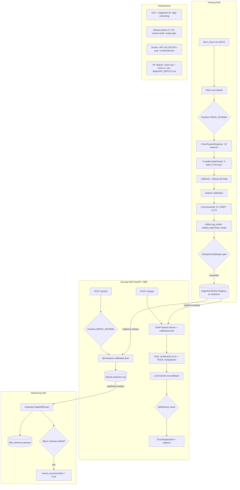

# Customer Churn MLOps

[](https://github.com/brej-29/customer-churn-mlops/actions/workflows/ci.yml)


[](https://dagshub.com/brej-29/customer-churn-mlops.mlflow)

**End-to-end MLOps system for telecom churn prediction** — a quality-gated XGBoost champion in a versioned registry, a FastAPI service with contract validation at every boundary, a RAG+LLM explanation layer with programmatic faithfulness evaluation, Evidently drift monitoring, multi-stage Docker builds, and a three-job CI pipeline that blocks on both tests and model quality.

This is not a notebook demo. Every layer has tests, contracts, and a CI gate.

---

## Live Demo

| | Link |
|---|---|
| **Interactive UI** | [https://huggingface.co/spaces/BrejBala/churn-ui](https://huggingface.co/spaces/BrejBala/churn-ui) |
| **API (Swagger)** |  [https://brejbala-churn-api.hf.space/docs#/](https://brejbala-churn-api.hf.space/docs#/)|
| **MLflow Tracking** | [dagshub.com/brej-29/customer-churn-mlops.mlflow](https://dagshub.com/brej-29/customer-churn-mlops.mlflow) |

---

## Problem & Dataset

**IBM Telco Customer Churn** — 7 043 rows × 21 columns, ~26.5% churn rate. Each row is one customer; the target is whether they churned within the last month. Features include contract type, tenure, monthly charges, internet service tier, and demographics.

Dataset source: [Kaggle — Telco Customer Churn](https://www.kaggle.com/datasets/blastchar/telco-customer-churn). Download the CSV and place it at `data/raw/telco_churn.csv`.

---

## Key Results

All metrics are from [`reports/final_test_metrics.json`](reports/final_test_metrics.json) — the held-out test split, never seen during training or tuning.

| Metric | Value | Notes |
|--------|-------|-------|
| **PR-AUC** | **0.660** | Primary metric — PR-AUC rewards precision at every recall level; ROC-AUC is optimistic on imbalanced data |
| ROC-AUC | 0.848 | |
| Brier score | 0.135 | After isotonic calibration |
| Precision | 0.462 | At cost-optimal threshold 0.174 |
| Recall | 0.872 | Catches 87% of churners |
| F1 | 0.604 | |
| Cross-val PR-AUC | 0.670 | 5-fold stratified CV on training set |
| Decision threshold | 0.174 | Cost-optimized: FN penalized 5× over FP (missed churner >> wasted retention offer) |

**Why PR-AUC is the primary metric:** At 26.5% churn, ROC-AUC inflates because it rewards true-negative performance — a model that always predicts "no churn" still scores 0.5 ROC-AUC. PR-AUC only evaluates the minority class and directly reflects the models that matter for retention campaigns.

**Calibration:** Isotonic regression tightens probability estimates (OOF Brier: uncalibrated 0.1334 → calibrated 0.1333). Well-calibrated probabilities are essential at the low threshold of 0.174 to avoid over-flagging.

**Baseline leaderboard (5-fold CV PR-AUC):** logreg 0.663 · catboost 0.651 · mlp 0.650 · lightgbm 0.639 · xgboost-base 0.622. XGBoost was selected for Optuna tuning (60 trials); the tuned model achieves 0.660 on the held-out test set. Full leaderboard: [`reports/leaderboard.csv`](reports/leaderboard.csv).

---

## System Overview

### Layer 1 — Modeling Pipeline

```
data → clean → Pandera contract → feature engineering
  → 5-model leaderboard → XGBoost + Optuna (60 trials)
  → isotonic calibration → cost-based threshold
  → MLflow log_model → champion/challenger gate
  → DagsHub registry @champion
```

- **Pandera `TRAIN_SCHEMA` / `SERVE_SCHEMA`**: Two separate data contracts derived from the same `ALLOWED` feature sets. A consistency test (`tests/test_churn_validation.py`) asserts that the Pandera `ALLOWED` sets match the API Pydantic `Literal` fields exactly — the training contract and serving contract cannot silently diverge.
- **Imbalance experiment**: Tested `none` vs `scale_pos_weight` vs SMOTE-NC. No-resampling won (PR-AUC 0.622 vs 0.612 vs 0.605), so the final model relies on cost-threshold selection rather than synthetic oversampling.
- **Champion/challenger gate**: `register_with_gate()` reads the current `@champion` version's `test_pr_auc` tag from the registry and only promotes if the new model beats it by ≥ 0.01 PR-AUC. An underperforming model is registered as `@challenger` and the champion alias is left untouched.

### Layer 2 — GenAI Explanation Layer (`/explain`)

```
POST /explain
  → @champion (calibrated probability + SHAP top features)
  → RAG: all-MiniLM-L6-v2 embeddings + FAISS (8 retention playbooks)
  → LLM prompt (SHAP-grounded, playbook context, strict anti-hallucination rules)
  → Gemini [→ Groq fallback]
  → ChurnExplanation {summary, key_factors, recommended_action, citations}
```

- **SHAP grounding**: The LLM prompt is constrained to cite only SHAP-identified top drivers. A `STRICT RULES` block bans the model from mentioning features not in the SHAP driver list. An explicit `CONSTRAINT` line lists the allowed driver names in each request.
- **RAG over retention playbooks**: 8 markdown playbooks (`data/playbooks/`) cover contract upgrades, price sensitivity, senior-customer retention, and more. Retrieved by cosine similarity over CPU embeddings; citations are attached to every explanation.
- **Faithfulness evaluation** (`churn/genai/eval.py`): A two-tier check (exact name match → semantic cosine similarity ≥ 0.5) verifies that every `key_factor` references a real SHAP driver. Running `run_faithfulness_eval(n_samples=50, random_state=42)` on the live Gemini endpoint scored **0.900** (45/50) after a prompt fix. The eval caught a real grounding bug: before the fix the score was 0.720 — the LLM was narrating raw dollar values ("high monthly charges") rather than citing the SHAP feature name. Adding the `CONSTRAINT` line raised faithfulness by 18 points.
- **Fallback design**: If the LLM call fails (no key, network error, API error), the endpoint returns `provider: fallback` with a rule-based explanation — never a 5xx.

---

## Architecture Diagram



---

## MLOps Features

| Feature | Location |
|---------|----------|
| **Pandera data contracts** — `TRAIN_SCHEMA` and `SERVE_SCHEMA` share `ALLOWED` sets; a test asserts they match the API Pydantic `Literal` fields | `churn/validation.py`, `tests/test_churn_validation.py` |
| **Champion/challenger registry gate** — new version promoted only if PR-AUC > current champion + 0.01 | `churn/registry.py` |
| **Optuna hyperparameter search** — 60-trial TPE study, results persisted to `reports/best_xgb_params.json` | `churn/tuning.py` |
| **Isotonic calibration** — OOF cross-calibration; Brier score and reliability curves logged to MLflow | `churn/evaluate.py` |
| **Cost-based threshold** — 5:1 FN/FP cost ratio; threshold stored in `reports/threshold.json` and as an MLflow version tag | `churn/evaluate.py` |
| **Evidently drift monitoring** — `DataDriftPreset` vs training reference; `retrain_recommended` flag when ≥30% of 19 features drift | `monitoring/drift.py` |
| **DVC + DagsHub S3** — raw dataset tracked in DVC; `dvc pull` in CI uses `DAGSHUB_USER`/`DAGSHUB_TOKEN` secrets | `.dvc/`, `ci.yml` |
| **DagsHub-hosted MLflow registry** — runs, params, metrics, artifacts, and `@champion` alias stored remotely | `churn/evaluate.py`, `churn/registry.py` |
| **Three-job CI pipeline** — `lint-test` (ruff + pytest offline), `docker-build` (build + verify UI has no ML packages), `model-quality-gate` (load `@champion`, assert PR-AUC ≥ 0.60) | `.github/workflows/ci.yml` |
| **Multi-stage Docker builds** — builder installs deps into `/opt/venv`; runtime is `python:3.11-slim` with non-root user; CPU-only torch strips `nvidia-*/cuda-*/triton` packages (saves ~6.5 GB) | `Dockerfile.api`, `Dockerfile.ui` |
| **HuggingFace model pre-baking** — `all-MiniLM-L6-v2` downloaded in builder at `HF_HOME=/opt/hf-cache`, copied to runtime; non-root user never needs write access | `Dockerfile.api` |
| **Faithfulness evaluation** — two-tier check (exact match → cosine ≥ 0.5); live score 0.900 after prompt fix; caught a real grounding bug at 0.720 | `churn/genai/eval.py` |
| **Fallback-safe `/explain`** — always 200; LLM failure → `provider: fallback`; champion absent → 503 | `api/main.py` |
| **Fairness analysis** — recall gap and FPR gap across gender, SeniorCitizen, Partner, Dependents | `churn/fairness.py`, `reports/fairness_*.csv` |
| **Prediction logging** — every `/predict` logged to SQLite; `/stats` exposes count, success rate, p50/p95 latency, avg probability | `api/main.py` |

---

## Tech Stack

| Layer | Technology |
|-------|-----------|
| ML modeling | XGBoost 2.x, scikit-learn (calibration, pipeline), LightGBM, CatBoost, imbalanced-learn |
| Hyperparameter search | Optuna 3.x (TPE sampler, pruning) |
| Explainability | SHAP |
| Data validation | Pandera 0.19 |
| Model tracking & registry | MLflow 2.13+, hosted on DagsHub |
| Data versioning | DVC 3.x + dvc-s3, DagsHub S3 remote |
| Drift monitoring | Evidently 0.7.21 (v2 API) |
| API | FastAPI, Pydantic v2, Uvicorn |
| UI | Streamlit |
| GenAI client | OpenAI-compatible (Gemini via Google endpoint, Groq fallback) |
| Embeddings / RAG | sentence-transformers 5.x (`all-MiniLM-L6-v2`), FAISS-CPU |
| CI | GitHub Actions — 3-job pipeline |
| Containers | Docker multi-stage builds; API 4.91 GB CPU-only torch; UI 830 MB slim |
| Deployment target | Hugging Face Docker Spaces ([deploy/HF_DEPLOY.md](deploy/HF_DEPLOY.md)) |
| Package manager | uv |
| Linting | ruff |
| Testing | pytest — 399 tests, all offline (GenAI/RAG mocked) |
| Python | 3.11 |
| License | MIT |

---

## Run It

### Prerequisites

```bash
# Install uv (if not already installed)
pip install uv

# Install all dependencies
uv sync

# Download the Telco CSV from Kaggle and place it at:
#   data/raw/telco_churn.csv
# https://www.kaggle.com/datasets/blastchar/telco-customer-churn
```

### Run tests (no API keys needed)

GenAI and RAG tests are mocked — all 399 tests run offline.

```bash
uv run pytest -q
# Expected: 399 passed
```

### Run the API locally

The API loads `models:/customer-churn-xgboost@champion` from the MLflow registry at startup.

```bash
export MLFLOW_TRACKING_URI=https://dagshub.com/brej-29/customer-churn-mlops.mlflow
export MLFLOW_TRACKING_USERNAME=<dagshub-user>
export MLFLOW_TRACKING_PASSWORD=<dagshub-token>
export GEMINI_API_KEY=<your-gemini-key>    # optional — enables /explain

uvicorn api.main:app --host 0.0.0.0 --port 7860
```

Key endpoints:

```
GET  http://localhost:7860/health   → {"status": "ok"}
POST http://localhost:7860/predict  → {"churn_probability": 0.xx, "churn_prediction": true/false}
POST http://localhost:7860/explain  → {"summary": "...", "key_factors": [...], "citations": [...]}
GET  http://localhost:7860/docs     → Swagger UI
GET  http://localhost:7860/stats    → {"count": N, "latency_p95_ms": ..., "avg_churn_probability": ...}
```

### Run the Streamlit UI

```bash
# In a second terminal (API must be running on :7860)
API_BASE_URL=http://localhost:7860 streamlit run ui/app.py
# Opens at http://localhost:8501
```

### Docker

```bash
# Build images
docker build -f Dockerfile.api -t churn-api .
docker build -f Dockerfile.ui  -t churn-ui .

# Run API (creds and data injected at runtime, never baked in)
docker run -d --name churn-api -p 7860:7860 \
  -e MLFLOW_TRACKING_URI=https://dagshub.com/brej-29/customer-churn-mlops.mlflow \
  -e MLFLOW_TRACKING_USERNAME=<dagshub-user> \
  -e MLFLOW_TRACKING_PASSWORD=<dagshub-token> \
  -e GEMINI_API_KEY=<your-key> \
  -v "$(pwd)/data/raw/telco_churn.csv:/app/data/raw/telco_churn.csv:ro" \
  -v "$(pwd)/logs:/app/logs" \
  churn-api

# Run UI
docker run -d --name churn-ui -p 8501:7860 \
  -e API_BASE_URL=http://host.docker.internal:7860 \
  churn-ui
```

The embedding model (`all-MiniLM-L6-v2`) is baked into the API image — no download at startup.

### Build and register the champion model

```python
# Requires: data/raw/telco_churn.csv, MLFLOW_TRACKING_URI set, ~2 min to run
from churn.evaluate import build_final_model
from churn.registry import register_with_gate

result = build_final_model()   # reads tuned params from reports/best_xgb_params.json
print(f"Test PR-AUC: {result.test_metrics['pr_auc']:.4f}")

reg = register_with_gate(
    model_uri=result.model_uri,
    candidate_metric=result.test_metrics["pr_auc"],
    model_name="customer-churn-xgboost",
    threshold=result.threshold,
    calibration_method=result.calibration_method,
)
print(reg)   # {"alias": "champion", "promoted": True, ...}
```

### Drift monitoring

```bash
# Requires prediction logs (run /predict calls first to populate logs/predictions.db)
uv run python -m monitoring.generate_drift_report
# Writes reports/drift_report.html and reports/drift_report.json
```

### Model quality gate

```bash
MLFLOW_TRACKING_URI=https://dagshub.com/brej-29/customer-churn-mlops.mlflow \
MLFLOW_TRACKING_USERNAME=<user> \
MLFLOW_TRACKING_PASSWORD=<token> \
uv run python scripts/check_champion_quality.py
# Expected output:  PR-AUC : 0.659744  (floor=0.6)  [PASS]
```

### Faithfulness evaluation

```python
# Requires GEMINI_API_KEY (or GROQ_API_KEY) and data/raw/telco_churn.csv
from churn.genai.eval import run_faithfulness_eval

result = run_faithfulness_eval(n_samples=50, random_state=42)
print(f"Faithfulness: {result.faithfulness_score:.3f}  ({result.n_faithful}/{result.n_samples})")
# Live result (Gemini, after prompt fix):  Faithfulness: 0.900  (45/50)
```

### Explore the modeling narrative

```bash
uv run jupyter notebook notebooks/churn_modeling_narrative.ipynb
# Notebook is committed with outputs — view results without re-executing
```

---

## Project Structure

```text
.
├── churn/                           # Core ML library
│   ├── config.py                    # pydantic-settings (CHURN_* env prefix)
│   ├── data.py                      # load_telco_raw, get_splits, TELCO_EXPECTED_SHAPE
│   ├── features.py                  # ChurnFeatureEngineer (sklearn Pipeline)
│   ├── models.py                    # build_model_pipeline, 5-model leaderboard
│   ├── tuning.py                    # Optuna study (60 trials, TPE)
│   ├── evaluate.py                  # build_final_model — calibrate, threshold, log
│   ├── registry.py                  # register_with_gate (champion/challenger gate)
│   ├── validation.py                # Pandera TRAIN_SCHEMA / SERVE_SCHEMA
│   ├── explain.py                   # SHAP local explanations
│   ├── fairness.py                  # recall/FPR gaps across demographic subgroups
│   └── genai/
│       ├── client.py                # OpenAI-compatible LLM client (Gemini / Groq)
│       ├── explainer.py             # SHAP + RAG + LLM → ChurnExplanation
│       ├── rag.py                   # FAISS index over 8 playbook embeddings
│       └── eval.py                  # run_faithfulness_eval (two-tier grounding check)
├── api/
│   └── main.py                      # FastAPI: /health /predict /explain /stats /recent
├── ui/
│   └── app.py                       # Streamlit UI (calls API over HTTP)
├── monitoring/
│   ├── drift.py                     # run_drift_check (Evidently v2 API, retrain flag)
│   └── generate_drift_report.py    # CLI: python -m monitoring.generate_drift_report
├── training/
│   └── train.py                     # Legacy training script (synthetic data baseline)
├── tests/                           # 399 tests — all offline (GenAI/RAG mocked)
├── scripts/
│   └── check_champion_quality.py   # CI model-quality gate (assert PR-AUC >= 0.60)
├── data/
│   ├── raw/                         # telco_churn.csv (DVC-tracked, not in git)
│   └── playbooks/                   # 8 retention playbooks for RAG (committed)
├── notebooks/
│   └── churn_modeling_narrative.ipynb   # Full narrative with outputs committed
├── reports/                         # Pre-computed artifacts (all committed)
│   ├── final_test_metrics.json      # PR-AUC 0.660, ROC-AUC 0.848, ...
│   ├── threshold.json               # threshold 0.174, 5:1 cost ratio
│   ├── leaderboard.csv              # 5-model CV comparison
│   ├── best_xgb_params.json         # Optuna-tuned XGBoost params
│   ├── fairness_disparities.csv     # recall/FPR gaps across 4 subgroups
│   └── *.png                        # PR curve, reliability plot, SHAP beeswarm
├── Dockerfile.api                   # Multi-stage, CPU-only torch, model pre-baked
├── Dockerfile.ui                    # Slim — streamlit + requests only, no ML stack
├── requirements-ui.txt              # UI-only deps for Dockerfile.ui
├── .github/workflows/ci.yml         # 3-job CI: lint-test / docker-build / model-gate
├── pyproject.toml                   # uv project file, ruff config, pytest config
└── .dvc/                            # DVC config (remote: DagsHub S3)
```

---

## Limitations & Future Work

**Honest limitations:**

- **No train CLI entrypoint.** `build_final_model()` and `register_with_gate()` are library functions; there is no `scripts/train.py`. A reviewer must call them from Python.
- **Static playbook corpus.** The 8 RAG playbooks are hand-written markdown files. A production system would maintain a curated, version-controlled database with automated retrieval evaluation.
- **Faithfulness eval requires a live LLM.** `run_faithfulness_eval` calls the LLM per sample — no offline mode, so it cannot run in CI without API keys.
- **No online feature store.** Features are re-computed per request from the payload. A production system would pre-compute and cache features upstream.
- **Drift monitoring is batch.** `generate_drift_report` reads the full SQLite log each run. A production system would stream to a feature store and trigger drift checks incrementally.
- **Single-container inference.** The Docker setup is one API container per process. Production scale would need a load balancer, autoscaling, and a proper secrets manager.
- **No A/B testing infrastructure.** The champion/challenger gate promotes in the registry, but there is no traffic-splitting mechanism to compare live metrics between versions.

**Natural next steps:**

- Deploy to Hugging Face Spaces (branch `tier3-deployment` is ready; see [deploy/HF_DEPLOY.md](deploy/HF_DEPLOY.md)).
- Add a `scripts/train.py` CLI entrypoint for the full Tier 1 pipeline.
- Add `/explain` faithfulness to the CI model-quality gate (threshold ≥ 0.85).
- Wire prediction logs to the drift monitor on a CI schedule.

---

## License

MIT — see [LICENSE](LICENSE).
